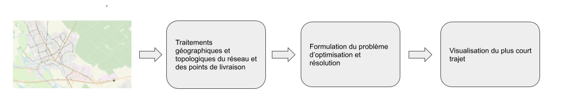
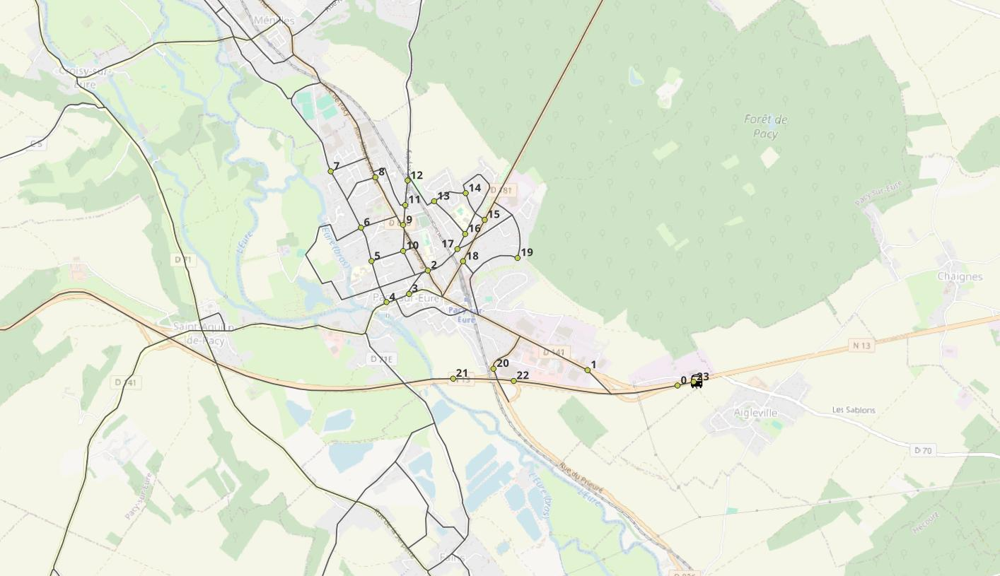

# Optimisation du parcours pour le dépôt ou la collecte d'objets

## Objectif

Me faisant parfois livrer (par une célèbre entreprise internationale) des ingrédients pour cuisiner, je me suis demandé si le livreur suivait un planning de livraison optimal afin de minimiser les coûts de déplacement. Ce démonstrateur illustre le célèbre problème du voyageur de commerce qui cherche à optimiser sa tournée.
Evidemment, si on remplace le célèbre livreur d'ingrédients par un célèbre livreur de colis ou une entreprise de collecte de déchets, c'est pareil 😉

# Démarche 
La démarche générale est illustrée ci-dessous

  

Celle-ci est détaillée dans le [notebook](optimisation_tournée.ipynb). Ce problème d'optimisation combinatoire est relativement simple à conceptualiser mais sa formulation est complexe. Le code code fourni dans les démonstrations de Gurobi est réutilisé et adapté à notre cas.

Les données d'entrée sont:

- Le réseau de transport routier sur la zone
- Les points de livraisons (clients) créés manuellement dans QGis

  

La résolution du problème d'optimisation fournit l'ordre de passage optimal

  

## Outils et données utilisées

- [Gurobi](https://www.gurobi.com/jupyter_models/traveling-salesman/) - Traveling Salesman Problem
- [Networkx](https://networkx.org/) - Traitement topologique de graphes
- [QGis](https://qgis.org/) - SIG utilisé pour la visualisation
- [Réseau_routes](https://geoservices.ign.fr/route500) - Réseau des routes française (IGN)
- Python pour le code 
