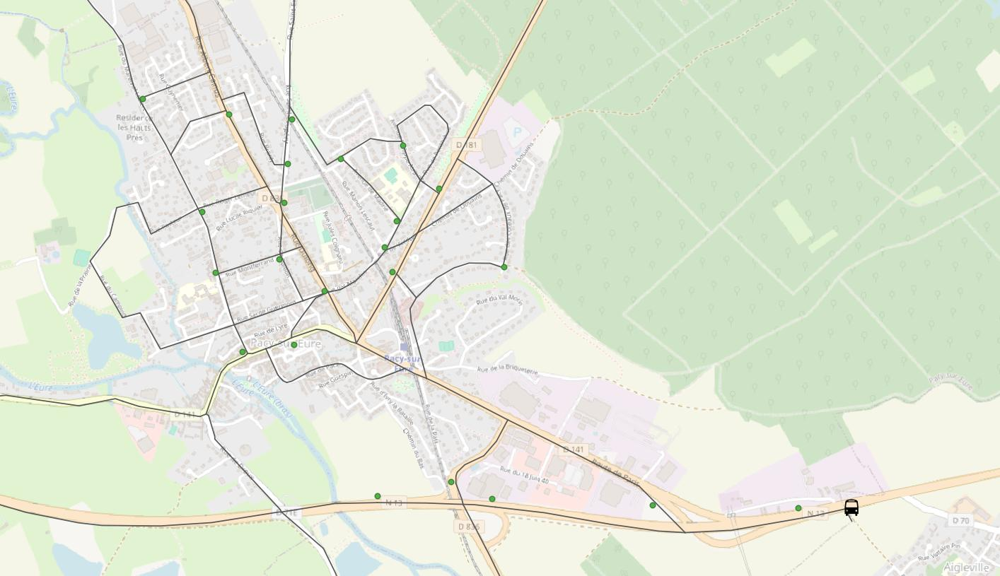

# Optimisation du parcours pour le dépôt ou la collecte d'objets

## Objectif

Me faisant parfois livrer (par une célèbre entreprise internationale) des ingredients pour cuisiner, je me suis demandé si le livreur suivait un planning de livraison optimal afin de minimiser les coûts de déplacement. Ce démonstrateur illustre le célèbre problème du voyageur de commerce qui cherche à optimiser sa tournée.
Evidemment, si on remplace le célèbre livreur d'ingrédients par un célèbre livreur de colis ou une entreprise de collecte de déchets, c'est pareil 😉

# Démarche 
La démarche est détaillée dans le [notebook]('optimisation tournée.ipynb')  
Les données d'entrée sont:

- Le réseau de transport routier sur la zone
- Le points de livraisons (clients) créés manuellement dans QGis

Ici, j'utilise geopandas pour les traitements géographiques et networkx pour décrire la topologie du réseau
Le problème d'optimisation est défini et résolu avec le package Gurobi

## Outils et données utilisées

- [Gurobi](https://www.gurobi.com/jupyter_models/traveling-salesman/) - Traveling Salesman Problem
- [Networkx](https://networkx.org/) - Traitement topologique de graphes
- [QGis](https://qgis.org/) - SIG utilisé pour la visualisation
- [Réseau_routes](https://geoservices.ign.fr/route500) - Réseau des routes française (IGN)
